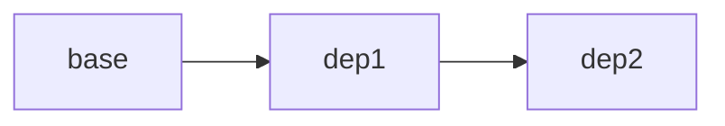
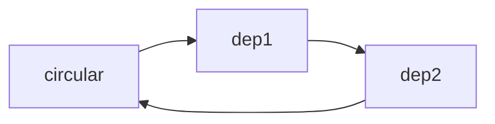
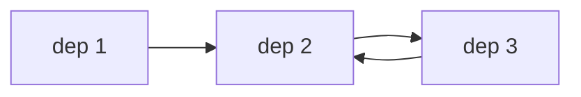
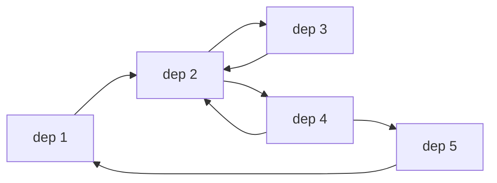
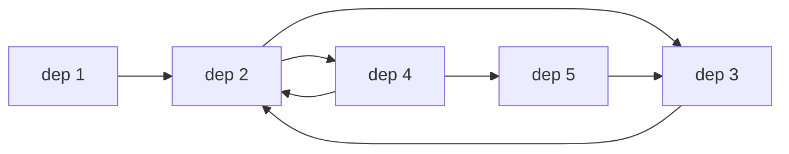
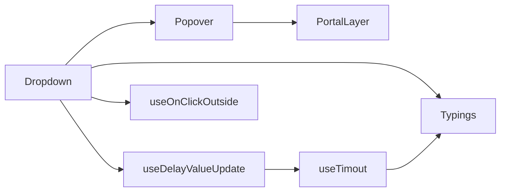
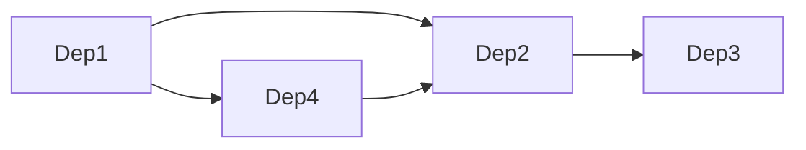
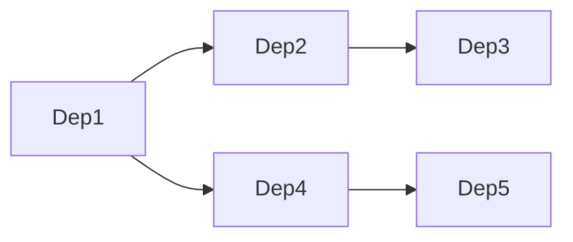
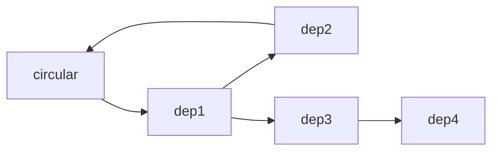

# Base

```mermaid
flowchart LR
  base --> dep1 --> dep2
```

# Circular 1

```mermaid
flowchart LR
  circular --> dep1 --> dep2
  dep2 --> circular
```

# Circular 2

```mermaid
flowchart LR
  1[dep 1]-->2[dep 2]
  2 --> 3[dep 3]
  3 --> 2
```

# Circular 3

```mermaid
flowchart LR
  1[dep 1]-->2[dep 2]
  2 --> 3[dep 3]
  3 --> 2
  2 --> 4[dep 4]
  4 --> 2
  4 --> 5[dep 5]
  5 --> 1
```

# Circular 4

```mermaid
flowchart LR
  1[dep 1]-->2[dep 2]
  2 --> 3[dep 3] & 4[dep 4]
  3 --> 2
  4 --> 2 & 5[dep 5]
  5 --> 3
```

# Simple 5

```mermaid
flowchart LR
  D[Dropdown] --> T[Typings]
  D --> P[Popover] --> PL[PortalLayer]
  D --> UDV[useDelayValueUpdate]
  D --> UOCO[useOnClickOutside]
  UDV --> useTimout --> T
```

# Simple 6

```mermaid
flowchart LR
  Dep1 --> Dep2 & Dep4
  Dep2 --> Dep3
  Dep4 --> Dep2
```

# Simple 7

```mermaid
flowchart LR
  Dep1 --> Dep2 --> Dep3
  Dep1 --> Dep4 --> Dep5
```

# Circular 8

```mermaid
flowchart LR
  circular --> dep1
  dep1 --> dep2 & dep3
  dep2 --> circular
  dep3 --> dep4
```
